# KBusiness Academy Platform (platform6) - Complete Workflow & Feature Catalog

This document provides a comprehensive overview of the workflows, architecture, admin tools, and public features built into the **KBusiness Academy Platform**.

---

## 1. Core Architecture & Stack

- **Framework**: Next.js 16 (App Router with Turbopack & React Server Components)
- **Database**: MongoDB with Mongoose ODM & Connection Pooling
- **Authentication & Security**: Clerk Auth with Role-Based Access Control (Admin vs. Student/User)
- **Styling & UI**: Vanilla CSS, Tailwind CSS utilities, Radix UI Primitives, Lucide Icons, and Glassmorphic Dark Themes
- **Visual Page Builder**: Puck Editor Framework (`@puckeditor/core`)
- **Whiteboard Engine**: Excalidraw Canvas (`@excalidraw/excalidraw`)
- **Analytics & Tracking**: Internal Click Tracking (`/api/click/[id]`) and Blog Analytics Engine

---

## 2. Platform Modules & Workflows

```mermaid
flowchart TD
    User([Public Visitor / Student]) --> PublicPage[Public Front-End]
    Admin([Administrator]) --> AdminPage[Admin Control Center]

    subgraph Public Front-End
        PublicPage --> Glossary[AEO Knowledge Glossary /glossary]
        PublicPage --> Catalog[Software & Tools Catalog /catalog]
        PublicPage --> Blog[Academy Blog /blog]
        PublicPage --> Courses[Courses & Quizzes /courses]
        PublicPage --> Whiteboard[Interactive Whiteboard /whiteboard]
        PublicPage --> Community[Community & Groups /community]
        PublicPage --> LandingPages[Custom Landing Pages /p/slug]
    end

    subgraph Admin Control Center
        AdminPage --> GlossaryAdmin[Glossary Manager & Bulk Importer]
        AdminPage --> AffiliateAdmin[Personal Affiliate Catalog]
        AdminPage --> PageBuilder[Puck Visual Page Builder]
        AdminPage --> ClickCampaigns[Click Campaigns & Black Book]
        AdminPage --> ContentAdmin[Blog & Content Engine]
        AdminPage --> EcommerceAdmin[GrooveSell, Products & Accounting]
    end
```

---

## 3. Detailed Module Breakdown

### 📚 Module 1: AEO Glossary & Knowledge Engine
The Glossary module acts as an **Answer Engine Optimization (AEO)** and semantic knowledge graph layer designed to capture organic search traffic and drive affiliate conversions.

#### Key Features:
- **Public Term Pages (`/glossary/[slug]`)**:
  - Structured AEO Direct Answer Summary Box for AI citation.
  - Responsive Video Masterclass player (with customizable default YouTube embed `https://youtu.be/8z5t3dRqOxo`).
  - **Attached Resources & Tools**: Displays linked directory products and personal affiliate catalog offers directly under the video player.
  - Deep Content Pathways & Conversion Funnels (automatically falls back to the KBusiness Academy blog).
  - Print View (`/glossary/[slug]/print`), Study Mode, and Bookmarks.
- **Admin Glossary Manager (`/admin/glossary`)**:
  - Full CRUD operations with rich metadata (AEO Summary, FAQs, Case Studies, Social Prompts).
  - Interactive 2-Column Catalog Picker for linking Directory Products & Affiliate Offers.
  - **Bulk Importer (`GlossaryImporter`)**: Supports pasting raw text (single terms, pipe-separated text) or JSON arrays (with automatic extraction from markdown code fences).

---

### 🔗 Module 2: Personal Affiliate Catalog
A dedicated database and management system for managing affiliate links, tracking URLs, and commission stats.

#### Key Features:
- **Catalog Management (`/admin/affiliate-catalog`)**:
  - Create, edit, and delete affiliate offers with details: Product Name, Direct Link, Tracking Link, Network, Price, Commission %, Payout Amount, and Notes.
  - Live click analytics per link via `/api/click/[id]`.
- **Bulk Import & Export**:
  - **JSON Export**: Downloads all catalog offers in formatted JSON.
  - **CSV Export**: Downloads a formatted CSV spreadsheet of all offers.
  - **Import Modal**: Supports uploading `.json` or `.csv` files or pasting JSON arrays/pipe-delimited text with real-time parsing previews.

---

### 🎨 Module 3: Puck Visual Page Builder
A drag-and-drop page builder enabling admins to create custom landing pages and sales funnels without code.

#### Key Features:
- **Admin Page List (`/admin/page-builder-simple`)**: Create, search, duplicate, preview, and delete pages.
- **Puck Visual Editor (`/admin/page-builder-simple/[id]`)**:
  - Visual canvas with drag-and-drop components (Hero, Features, Pricing Tables, Testimonials, CTA Banners, Video Embeds).
  - Live state saving and theme token integration.
- **Public Rendering (`/p/[slug]`)**: Renders published Puck JSON pages server-side with optimal SEO and fast load speeds.

---

### 📈 Module 4: Click Campaigns & Competition Black Book
An ad-swipe and competitive intelligence suite designed for marketers.

#### Key Features:
- **Competitor Tracking (`/tools/competition-black-book`)**: Store competitor ad swipes, positioning strategies, and funnel breakdowns.
- **Campaign Engine (`/admin/click-campaigns`)**:
  - Copywriting Frameworks (PAS, AIDA, BAB, FAB, 4Ps).
  - Headline Generator, Power Words Library, and Pixel Checklist.
  - AI Creative Prompter & Copilot for generating ad angles.

---

### ✏️ Module 5: Interactive Whiteboard Engine
A full-screen, virtual visual workspace built on Excalidraw.

#### Key Features:
- **Canvas Route (`/whiteboard`)**:
  - Full-screen drawing canvas for brainstorming, strategy mapping, and note-taking.
  - Automatic debounced persistence to local storage per business profile.
  - Built-in **React Error Boundary (`WhiteboardErrorBoundary`)** to prevent crashes and provide 1-click cache resets.

---

### 🛠️ Module 6: Additional Suite Tools
- **Wholesale Supplier Directory (`/tools/wholesale-directory`)**: Searchable directory of wholesale suppliers and manufacturing partners.
- **Amazon Product Engine & Pin Generator (`/tools/amazon-product-engine`)**: Tool for extracting Amazon products and generating social media images/pins.
- **Community & Student Portal (`/community`, `/courses`)**: Discussion groups, member profiles, structured courses, and quiz engine.

---

## 4. Summary of Key Files

| Feature | Key Files |
| :--- | :--- |
| **Glossary Engine** | [app/glossary/[slug]/page.tsx](file:///c:/Users/erove/Desktop/kbacademy/platform6/app/glossary/%5Bslug%5D/page.tsx), [GlossaryForm.tsx](file:///c:/Users/erove/Desktop/kbacademy/platform6/components/admin/GlossaryForm.tsx), [GlossaryImporter.tsx](file:///c:/Users/erove/Desktop/kbacademy/platform6/components/admin/GlossaryImporter.tsx) |
| **Affiliate Catalog** | [app/admin/affiliate-catalog/page.tsx](file:///c:/Users/erove/Desktop/kbacademy/platform6/app/admin/affiliate-catalog/page.tsx), [AffiliateCatalogImportExportModal.tsx](file:///c:/Users/erove/Desktop/kbacademy/platform6/components/admin/AffiliateCatalog/AffiliateCatalogImportExportModal.tsx), [personal-affiliate.actions.ts](file:///c:/Users/erove/Desktop/kbacademy/platform6/lib/actions/personal-affiliate.actions.ts) |
| **Page Builder** | [puck-config.tsx](file:///c:/Users/erove/Desktop/kbacademy/platform6/lib/puck-config.tsx), [PuckEditor.tsx](file:///c:/Users/erove/Desktop/kbacademy/platform6/components/admin/PuckEditor.tsx), [PuckRenderer.tsx](file:///c:/Users/erove/Desktop/kbacademy/platform6/components/PuckRenderer.tsx), [app/p/[slug]/page.tsx](file:///c:/Users/erove/Desktop/kbacademy/platform6/app/p/%5Bslug%5D/page.tsx) |
| **Whiteboard** | [excalidraw-wrapper.tsx](file:///c:/Users/erove/Desktop/kbacademy/platform6/app/(dashboard)/whiteboard/_components/excalidraw-wrapper.tsx), [client-whiteboard.tsx](file:///c:/Users/erove/Desktop/kbacademy/platform6/app/(dashboard)/whiteboard/_components/client-whiteboard.tsx) |

---
*Created automatically for KBusiness Academy Platform.*
